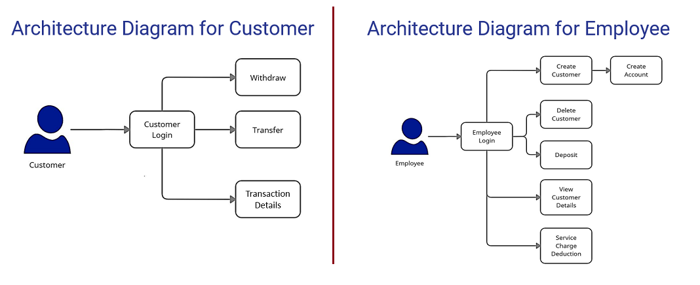
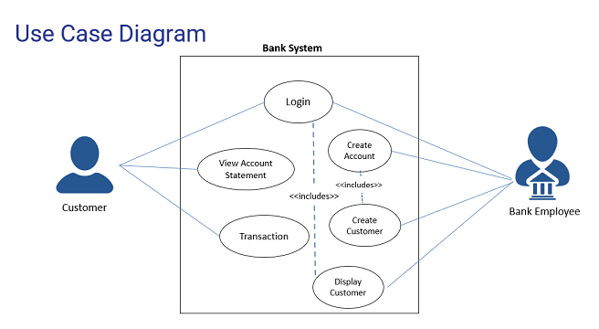

# 👯 Retail Banking System
* The	**Retail	Banking	System**	provides	**Microservice	Architecture** based software solution.
* It provides **high Availability operations** for their client & bank  employees without disruption.
* Different Microservices like **“Account”, ”Customer” and “Transaction”** etc. are combined together to perform together as  a Unified application.
## ⚡ Technologies
- Frontend : **Angular 8**
- Backend : **Java, Spring Boot, Restful-Services**.
- Database : **H2 - database**
- Tools : **Spring Tool Suite, Swagger, Eclemma, Postman, AWS**

## 📫 Architecture Diagram 
 
 
## 💬 Use Case Diagram 
 
 
## 🎯 UI Snap-Shots (Final Output)

